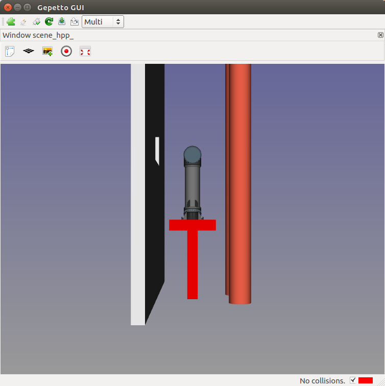

Programming RRT algorithm
=========================

Objective
---------
Program RRT algorithm in python.

Introduction
------------
Open a terminal cd into hpp-practicals directory and open 2 tab by typing CTRL+SHIFT+T.
In the first terminal, type
[source,sh]
----
gepetto-gui -c basic

----

In the second terminal, type
[source,sh]
----
cd script/pyhpp
python -i rrt.py
----

You should see the message "Method solveBiRRT is not implemented yet". Open file +script/motion_planner.py+ in a text editor. The message is produced by method +solveBiRRT+ of class +MotionPlanner+.

Before starting
---------------
Unlike the old CORBA server implementation, HPP objects can now be created and accessed direclty using boost python bindings.
A roadmap is compsed of nodes and edges. Nodes contain configurations. Edges contain paths. The roadmap can be extended using methods

* +roadmap.addNode+,
* +roadmap.addEdge+.

Calls to method +problem.steeringMethod.steer+ create a new path between two configurations. This path is stored in a vector on the server side and can be accessed by the
index in the vector.

See Section "Some useful methods" below.

Displaying a configuration
~~~~~~~~~~~~~~~~~~~~~~~~~~

While running, your RRT algorithm will produce configurations and paths to store in the roadmap
edges. To display a configuration +q+, first create a client to +gepetto-gui+ in the python terminal:
[source,python]
----
>>> v = Viewer(robot)
----

You should see the above window displaying a manipulator robot surrounded by obstacles.

Then, typing in the python terminal
[source,python]
----
>>> v (q1)
----
You shoud see the robot in configuration +q1+.

Displaying a path
~~~~~~~~~~~~~~~~~

Functions that create a path (such as +steer+ below) append
the created path to a vector. The path can be displayed by using +playPath+. To display the result of your algorithm, type

[source,python]
----
>>> v.playPath(path)
----

You can also use +gepetto-gui+ path player to display a path. For that, in menu +Tools+, select +Reset connections+ then +Refresh+. In menu +Windows+, select +Path player+.

Hint
~~~~

You can use methods of objects +robot+ and +problem+.

In +class MotionPlanner+, you can access these object by

[source,python]
----
>>>  self.robot
>>>  self.problem
----

Some useful methods
~~~~~~~~~~~~~~~~~~~
[source,python]
----
#
# Note for all the methods below,
#   - configurations are represented by lists of float,
#   - "index of the path" means index in the vector of paths stored on the server side,
#

# Shoot a random configuration within bounds of robot
#
# return: a configuration
problem.configurationShooter().shoot()

# Get nearest node of given input configuration in a connected component of the  current roadmap
#
#  config:               the input configuration
#  connectedComponentId: the index of a connected component in the roadmap,
#                        if is negative, considers the whole roadmap
# return:                nearest configuration,
#                        distance between nearest configuration and input configuration
roadmap.nearestNode(config, connectedComponentId)

# Build direct path between two configurations
#
#  q1, q2:     start and end configurations of the direct path
#
#  return:     the generated path
problem.steeringMethod().steer (q1, q2)
problem.steeringMethod(q1, q2)

# Validate generated path by steering method
#
#  path:     path previously generated,
#  validation: whether the path should be tested for collision,
#
#  return:     whether the path is valid (True if validation is set to False),
#              the valid part of the path,
#              a string describing why the path is not valid, or empty string.
#
#  note:       When the path between q1 and q2 is not valid, the method returns
#              a part of the path starting at q1 and ending before collision.
problem.pathValidation().validate(path, validation)

# Combine both functions above
problem.directPath(q1, q2, validation)

# Add a configuration to the current roadmap
#
#  q: configuration
roadmap.addNode(q)

# Add an edge to the current roadmap
#
#  q1, q2:    configurations stored in the nodes to be linked by the edge,
#  path:    the path linking q1 and q2 to be stored in the edge,
#  bothEdges: whether an edge between q2 and q1 should also be added.
roadmap.addEdge(q1, q2, path, bothEdges)

# Get length of path
#
#  path: the path
#
#  return: length of the path. The interval of definition of the path starts at
#          0 and ends at the path length.
path.length ()

# Get configuration along a path
#
#  pathId:    index of the path
#  parameter: parameter in interval of definition of the path
#             (see method pathLength)
#
#  return: configuration of path at given parameter
path (pathId, parameter)
path.eval(pathId, parameter)

# Get the number of connected components of the current roadmap
#
#  return: number of connected components
roadmap.numberConnectedComponents()
----

Before starting we recommend that you play a little with the above methods,
creating and displaying some configurations and paths in the +python+ terminal.

Exercise 1
----------

In file +script/motion_planner.py+, remove instruction
[source,python]
----
    print ("Method solveBiRRT is not implemented yet")
----
and implement RRT algorithm between markers
[source,python]
----
      #### RRT begin

      #### RRT end
----
