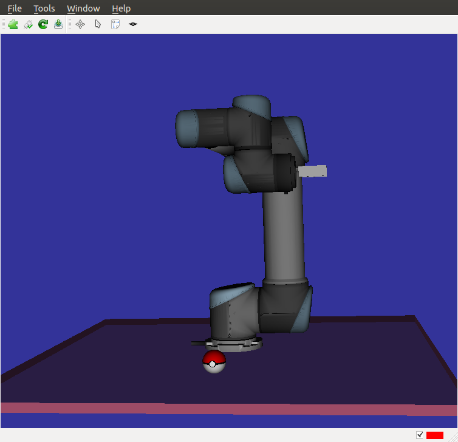
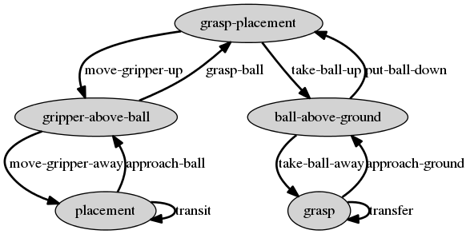

Manipulation planning
=====================

Objective
---------

Define a constraint graph and plan a manipulation path.

Introduction
------------
Open a terminal, cd into hpp-practicals directory and open 2 tab by typing CTRL+SHIFT+T. In the first terminal, type
[source,sh]
----
gepetto-gui
----

In the second terminal, type
[source,sh]
----
cd script/pyhpp
python -i grasp_ball.py
----

To display the robot and environment, create again a client to +gepetto-gui+ in the python terminal:
[source,python]
----
>>> v = Viewer()
----

You should see the above manipulator on a horizontal plane and a ball.
You can display the initial and goal configurations of the problem defined in
the script by typing respectively

[source,python]
----
>>> v (q_init)
>>> v (q_goal)
----

Displaying the constraint graph
~~~~~~~~~~~~~~~~~~~~~~~~~~~~~~~

In the python terminal, you can print the constraint graph by typing:

[source,python]
----
>>> graph.display ('./out.dot')
----

You can now go to https://dreampuf.github.io/GraphvizOnline or any other tool to display the content of the dot file.

Solving the problem
~~~~~~~~~~~~~~~~~~~

Typing
[source,python]
----
>>> manipulationPlanner.solve ()
----
should solve the problem in a minute or so.

Displaying the path
~~~~~~~~~~~~~~~~~~~
As in exercise 1, the path can be displayed using the path player
[source,python]
----
>>> p = manipulationPlanner.solve ()
>>> v.playPath(p)
----
You can also display the path using the path player in +gepetto-gui+.

A more difficult problem
------------------------

script +grasp_ball_in_box.py+ defines the same problem as
+grasp_ball.py+, except that in the initial configuration, the ball
is in a box. The resolution takes a lot more time since RRT algorithm
needs to generate a lot of states before the gripper reaches the
ball in the box.

Exercise 2
----------

Exercise 2.1
~~~~~~~~~~~~

In order to help the manipulation planner, define in file
+grasp_ball_in_box.py+ a constraint graph with intermediate states like for
instance:

- a state where the gripper is empty above the ball
- a state where the gripper holds the ball above the ground.

The graph below provides an example.

WARNING: When adding states to the graph  (+graph.createState+) the order of the additions is important: when checking in which state a configuration lies, state constraints will be checked in the order of state creation.

Exercise 2.2
~~~~~~~~~~~~

Using the above constraint graph, write a script that builds a sequence of paths
from +q_init+ to +q_goal+. An example of how to generate a path from +q_init+ to a grasp configuration is provided by script +solve_by_hand.py+, for the manipulation problem without box.

The script, named +solve_by_hand_with_box.py+ should define a list of
indices named +paths+ corresponding to indices in the vector of paths. Each path should be admissible with respect to the manipulation constraints, and the concatenation of the paths should start at +q_init+ and end at +q_goal+.

Hints
-----
To test a state named `state`, you can use the following loop:
[source,python]
----
for i in range(100):
  q = problem.configurationShooter().shoot()
  res, q1, err = graph.applyStateConstraints (state, q)
  if res: break
----
If `i==99 and res == False`, the constraint is probably malformed. Otherwise
configuration `q1` is in the state.

To test a transition `transition`, you can use the following loop:
[source,python]
----
for i in range(100):
  q = problem.configurationShooter().shoot()
  res, q2, err = graph.generateTargetConfig (transition, q1, q)
  if res: break
----
where `q1` is a configuration in the starting state of `transition`.
If `i==99 and res == False`, the constraint is probably malformed. Otherwise,
configuration `q2` is in the destination state of `transition` and accessible from
q1 following this transition.

Some useful methods
~~~~~~~~~~~~~~~~~~~
[source,python]
----

# Get a joint Id from its name
#
# name : name of the joint
#  return:
#    Id of the joint (Id)
robot.model().getJointId(name)

# create a relative transformation between two joints
#
#  name :     name of the function,
#  robot :    pinocchio device,
#  joint1 :    Id of the first joint,
#  joint2 :    Id of the second joint,
#  relativeTransform :    relative transformation of joint2 frame in joint1 frame,
#  mask :    list of 6 Boolean to select active coordinates of the constraint.
#  return : function that can be used to create constraints
pc = Transformation.create(name, robot, joint2, joint1, relativeTransform, mask)

# create an implicit constraint
# f : function describing the constraint,
# cts: ComparisonTypes mask
# mask : mask 
constraint = Implicit.create(f, cts, mask)

# Create states of the constraint graph
#
#  stateName: name of the state to be created.
#  waypoint: if the state is a waypoint.
#  priority: affects how the states are ordered.
#
#  note:     States are ordered according to the list passed to this method. When
#            determining to which state a configuration belongs, constraints of
#            the states are tested in the creation order. As a consequence, it
#            is important that if the subspace defined by "state1" is a subset of
#            the subspace defined by "state2", "state1" is placed before "state2"
#            in the input list.
graph.createState (stateName, waypoint, priority)

# Create an transition of the constraint graph
#
#  state1:     state the transition starts from,
#  state2:     state the transition reaches,
#  transitionName:  name of the transition,
#  belongsTo: state in the subspace defined by which paths of the transition lie.
graph.createTransition (state1, state2, transitionName, weight, belongsTo)

# Set constraint relative to state
#
#  stateName :   name of the state
#  cs   : list of constraints to be passed to the state
graph.addNumericalConstraintsToState (state, cs)

# Set constraint relative to transition
#
#  transitionName :   name of the transition
#  cs   : list of constraints to be passed to the transition
graph.addNumericalConstraintsToTransition (transition, cs)

# Project a configuration on the supspace defined by a state
#
#  stat:  state,
#  q:        input configuration.
#
#  return:
#    whether projection succeeded (Boolean),
#    projected configuration,
#    numerical error
graph.applyStateConstraints (state, q)

# Project a configuration on a leaf of the foliation defined by an transition
#
#  transition: transition,
#  q1:       configuration defining the leaf (right hand side of constraint),
#  q2:       configuration to project on the leaf.
#
#  return:
#    whether projection succeeded (Boolean),
#    projected configuration,
#    numerical error
graph.generateTargetConfig (Name, q1, q2)

----
